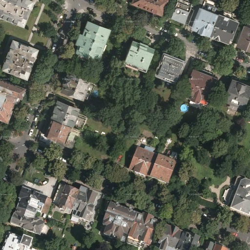
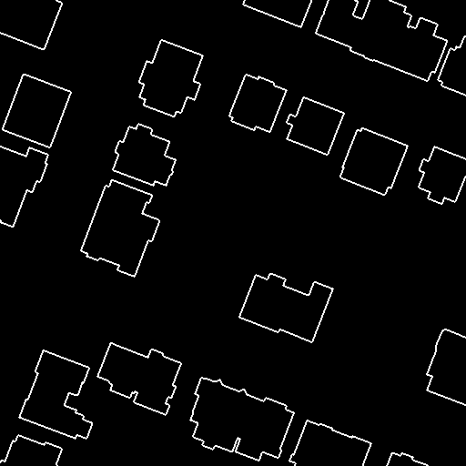
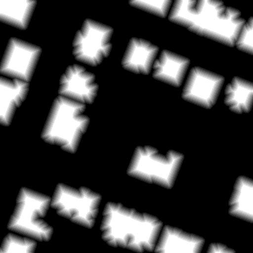

# Building Identification in Aerial Imagery
This repository encompasses code for experiments related to building identification in aerial imagery. It comprises code for the conducted experiments, including:

  
  <figcaption>Image</figcaption>
  
  <figcaption>Ground truth mask</figcaption>

  
  <figcaption>Boundary</figcaption>
  
  <figcaption>Distance map mask</figcaption>

Data processing 

This directory houses files for data formatting, such as patch extraction, image boundary extraction, and distance map creation.

Baseline models 

This directory contains the baseline models considered for semantic segmenation. 

Boundary models 

This directory contains the multitask model that utilize boundary information for semantic segmenation 

Distance map models 

This directory contains the multitask model that utilize distance map information for semantic segmenation 

Evaluation 

* train_valid_test_eval: This directory contains code for evaluating the performance of baseline, boundary error, and distance map models.

* boundary_error: This directory contains code for specifically evaluating the boundary error for baseline, boundary error, and distance map models.

